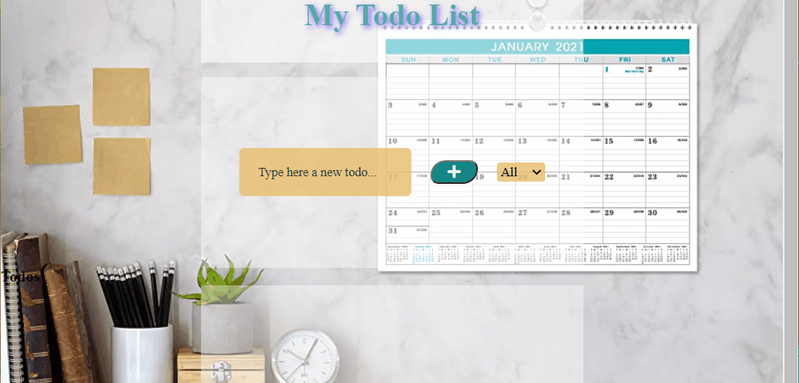

# My React App Building a TO-DO Project

Simple TO-DO App created by using React.Where users can save their tasks and remove them from their lists once its done.

## Learning Objectives

-Learning how to work with hooks like useState,useEffect.
-Working with different components feature by feature.
-Save inputs in LocalStorage by using UseEffect.
-Getting familiar with the JSX syntax

### Tools

*Visual Studio Code
*React.js

